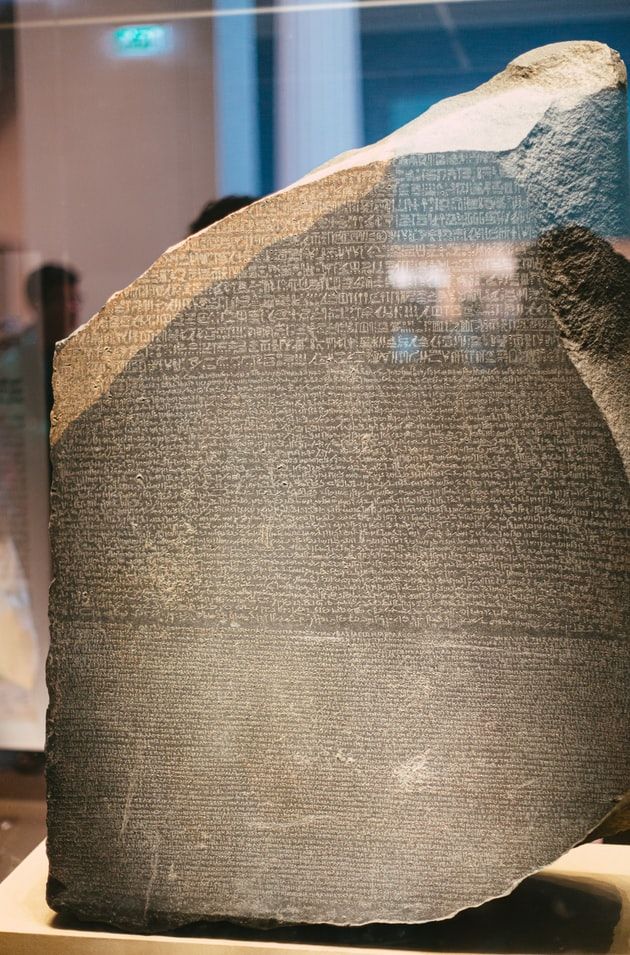

# Flutter Design And Arch Rosetta

I am creating a Flutter Development and Design Book series and this is the huge repo for it. Features:

- Widget Layouts

- Complete Apps

- Devops Solutions

- Design UI Tricks

- App Architecture Examples

- OOP and FP techniques

## Articles

DevOPS

Tuning A Cheap MS Windows Laptop for Flutter Devepoment https://medium.com/p/tuning-a-cheap-ms-windows-laptop-for-flutter-app-development-572d09cd4d19

Log Driven Learning Flutter https://medium.com/codex/log-driven-learning-flutter-d76b49b75a8c

UML Coolness in Flutter https://itnext.io/uml-coolness-in-flutter-6bb14217b5f2

Lint Like A Boss https://itnext.io/lint-like-a-boss-60b85e82c227

McCabe Cycles in Flutter https://medium.com/p/mccabe-cycles-in-flutter-3aa913e19428

Getting Real Code Coverage https://medium.com/p/getting-real-code-coverage-951231afa2bc

Lcov on Windows https://medium.com/p/lcov-on-windows-7c58dda07080

Test Secrets, Test Suites https://itnext.io/test-secrets-test-suites-99f8390b8d4b

How To, Flutter Internal Packages https://itnext.io/how-to-flutter-internal-packages-cad1285fe8c

An Architecture Layout https://medium.com/codex/an-architecture-layout-8f414271b2b4

Logging, The Expert Way https://medium.com/codex/logging-the-expert-way-5beb5c967e44

Catch Flutter Application Exceptions https://itnext.io/catch-flutter-application-exceptions-cad036d0fd4e

Flutter Perfect SetUp https://medium.com/codex/flutter-perfect-setup-c5462b412f78

Cool Flutter Docs https://medium.com/p/cool-flutter-docs-383b951d7feb

Visual

Animations Users Love(rive) https://medium.com/codex/animations-users-love-75a57a8cad5

Full Flutter Background Trick https://medium.com/p/full-flutter-background-trick-d1ea813470d2

Cool Rive Background Animation in Flutter Apps https://medium.com/p/cool-rive-background-animation-in-flutter-apps-2fd5e58bc81b

## About Me, Fred Grott

I am on a different adventure of creating a Maker and Creator studio startup, the bootstrap way
in teaching Flutter Application Design and Development to you guys and gals. 

The idea for the studio, is some will be creative in the front end apps created; and some of it will 
be maker with some iOT stuff and some embedded stuff. Along with the DIY IT-infrastructure stuff such as 
video-NAS, a app-build-NAS, and a flutter build server with some front-end target child build servers.

My keybase profile is at: https://keybase.io/fredgrott

My current set-up is an Asus x750j, MS Windows 10(I actually prefer Linux and MacOSX, too bad LiteSetp is no-longer maintained so that I could switch MS Windows Shell to fully customize the Desktop Screen-UI into something better), one LCD on TVHD screen, and starving for a decent Apple mini so I can get a decent wacom-drawing-tablet as my laptop is 
so old that it only has usb-A ports.

Tool-wise its, for graphics its Krita and  Inkscape. For IDE dev stuff it's MS Windows Terminal, VSCode(Insiders Edition), and MS Powershell. Book publishing wise it's markdown and some tool-chain to build the pdfs and ebook files and git.