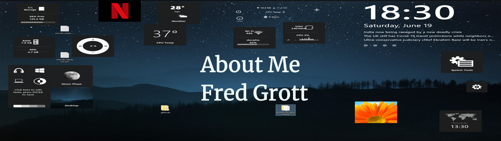

# Catch App Errors

Combines an implementation of logging strategy with device information collection and proper zone implementation to catch app exceptions.

## Tech Used

- Sentry

- Catcher

- Logging and Developer Log

- Logging Appenders

- Zones

- Futures

## Resources

General Flutter and Dart resources:

Flutter Community Resources <https://flutter.dev/community>

Flutter SDK <https://flutter.dev/docs/get-started/install>

Android Studio IDE <https://developer.android.com/studio>

MS's Visual Studio Code <https://code.visualstudio.com/>

Flutter Docs <https://flutter.dev/docs>

Dart Docs <https://dart.dev/guides>

Google Firebase Mobile Device TestLab <https://firebase.google.com/docs/test-lab>

## About Fred Grott

What happens when you redefine front-end programming and application design as the movement to teach humans with less pain and stress and move fun? Visit often, become a follower and find out. My blog is at:

<https://fredgrott.medium.com>
and you can DM me on the Keybase platform: <https://keybase.io/fredgrott>
