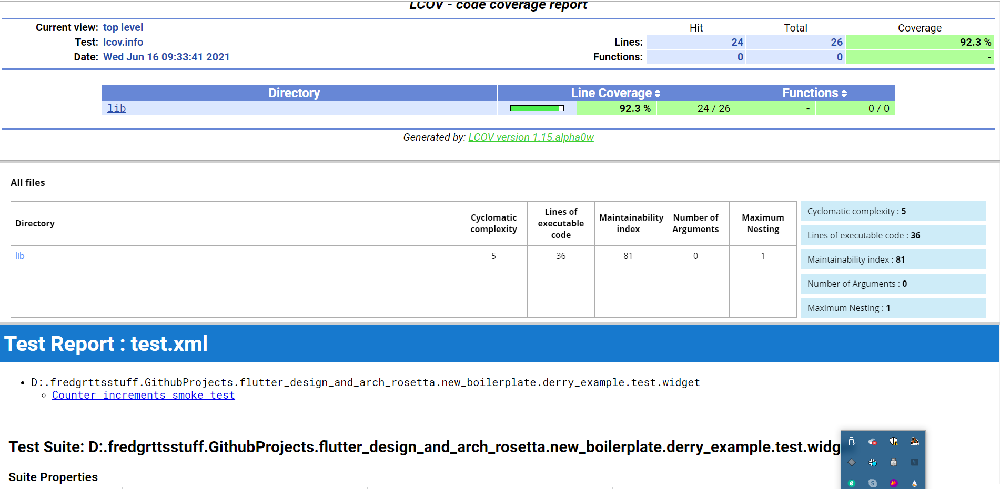
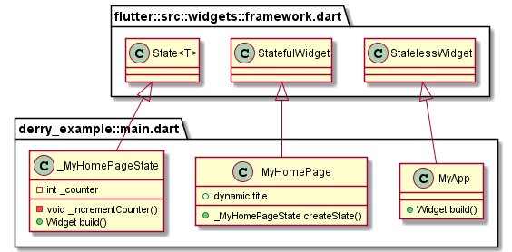

# Derry example

An example of using Derry Scripts for a project workflow in flutter app development and the output to produce the reports derry scripts trigger:

And the UML diagrams:

Prerequisites:

[pubviz visualize pub deps](https://pub.dev/packages/dcdg)

[junitreport output test report as XML then run junit2html Perl script for your OS platform](https://pub.dev/packages/junitreport)

[find LCOV for your OS platform for coverage reports in html](http://ltp.sourceforge.net/coverage/lcov.php)

[dcdg is the uml](https://pub.dev/packages/dcdg)

[derry at pubdev](https://pub.dev/packages/derry)

[build runner](https://pub.dev/packages/build_runner)

General Flutter and Dart resources:

Flutter Community Resources <https://flutter.dev/community>

Flutter SDK <https://flutter.dev/docs/get-started/install>

Android Studio IDE <https://developer.android.com/studio>

MS's Visual Studio Code <https://code.visualstudio.com/>

Flutter Docs <https://flutter.dev/docs>

Dart Docs <https://dart.dev/guides>

Google Firebase Mobile Device TestLab <https://firebase.google.com/docs/test-lab>

My journey is creating a maker and creator studio by bootstrapping through teaching developers and designers how to develop dart and flutter applications. My premise in front-end app creation is that we, as developers and creators, are not creating code, graphics, and the experience but instead teaching humans how to learn about that task they want to do.

That journey we invite the app-user on with our app is a journey that works backward from inside the use to outside the user. Make an impact on the user's inner life, and then 100% of what you want to teach automatically becomes taught. This new premise came from my journey in getting my ADHD under control.

Part of my teaching process is also to out-loud introduce you to the meta-conversation that every successful developer and designer has in their head when they confront new challenges and produce solutions.

You can DM me at my Keybase Profile as there is a growing community of both app developers, backend coders, and app designers on keybase:<https://keybase.io/fredgrott>
